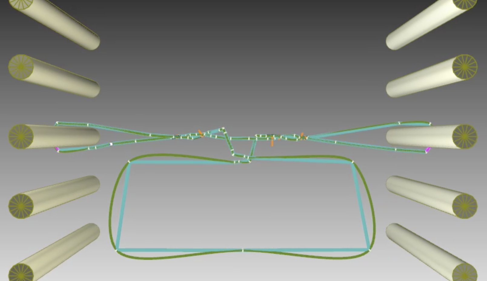

# Physical simulation for string figure.

## Introduction

String figure is a traditional game with a loop of string played by hooking and/or unhooking strands of the loop from fingers to produce patterns representing certain objects. Following is an instance of the string figure named "Jacob's ladder".

This site shows a method for generating patterns of the string figure using physics simulations.


Fig.1: The pattern of the string figure "Jacob's ladder"

Movie: [playing with the "jacob's ladder"](https://youtu.be/6fOrDCtNgfA)
(This video has alternative string manipulations that are not the original one. (Specifically, the last step named "osage extension" is replaced).  The reason for this change is to make it easier to explain "string finger simulation.")

## Preliminary
We define terms of the string figure, and codes representing string manipulations.
These definitions are based on [string figure notation](https://www.alysion.org/figures/notation.htm).

### Definition of terms for the string figure.
- *noose* ... a strand of the loop hanging on a finger. The thumb noose is a noose hanging on the thumb. Similarly, we introduce the forefinger, middle finger, ring finger, and little finger noose. 
- *top noose*, *bottom noose* ... In the string figure, a finger sometimes has multiple nooses. To distinguish the multiple nooses, the words of the top noose and the bottom noose are used for the nooses hanging at the top and the bottom on a finger, respectively.
- *finger string* ... there are two points at which the noose string leaves the finger.  These two points are denoted as a *near finger string* and a *far finger string*, respectively. In addition, the points are collectively referred as finger strings. For example, the top noose string on the forefinger, which is farther from the player, is denoted as the top far forefinger string. 


Fig.2: terms of the string figure

### Definition of "finger movement code"
Finger movement codes denotes string manipulations of the string figure. This is a subset of the string figure notation.

```bnf
<code> := up <noose>
        | re <noose>
        | <finger> (ma | mt) tw <noose> .
        | <finger> <move>* pu (<noose> | <string>)
<finger> := T | F | M | R | L.
<move> := (mo | mu) <string>.
<string> := <height> <depth> <finger> S.
<noose> := <height> <finger> N.
<height>:= t | b | .
<depth> := n | f | .
```

The non-terminal symbol `<code>` represents a single movement in the string figure. `<finger>` is a single capital alphabet letter that denotes one of the five fingers. For example, T means the thumb. 

`up` denotes picking the bottom noose and placing it to the top of the figure. `re` denotes a finger movement to release a noose. *Releasing a finger noose* means the finger movement to unhook the noose from the finger.

`tw` denotes a 360-degree rotation of a finger noose. Direction of the rotation has two types, `ma` and `mt`; `ma` (move away) means to move the fingertip first away from the player and then rotate the finger downward, toward to the player, and upward in order. `mt` (move toward) means the inverse rotation. 

`pu` denotes a finger movement to pick up a noose or a string. *Picking up a noose* with a finger means releasing the noose and hooking it onto the finger. *Picking up a string* with a finger means the string manipulation to hook the string with the back of the finger and make a new finger noose.

## Generating patterns of the string figure by physical simulation

### Simulation scene
Simulation scene consists of 5 cylinders on each side and a wire object.


Fig.3: a simulation scene

Movie: [a simulation scene in the middle of Jacob's ladder](https://youtu.be/e5aqfLBSoUo)

The lower cylinders and the upper cylinders correspond to thumbs and the little fingers respectively. The wire object represents the loop of the string.

During the simulation, the left and right cylinders move away from each other in the x-axis direction, and the string is pulled along with them. 

### String manipulation by altering paths
String manipulation is achieved by making changes to the wire path data without simulation. This process includes following four steps:
1. packing the path of the wire object,
2. loosening the path, 
3. extending finger strings, and
4. path alteration according to a string manipulation.

#### Packing the path of the wire object.

The path of the wire object is obtained from the final scene of the simulation.


Fig.4: a path information obtained from the final scene of the simulation

The path information is recorded as a sequence of three-dimensional points along the path. The first step is to shrink the points in the x-axis direction. The packing algorithm first clusters the points according to Euclidean distance. And then the algorithm moves the clusters (and all points in them) along the x-axis so that all clusters are equally spaced.


Fig.5: packing algorithm overview


Fig.6: the result of applying the packing algorithm to the path information in Fig 4.


#### Loosening the path
This step moves the points along the z-axis to give a little slack to the path of the string.

#### Extending the finger strings
This step moves all of the nooses around the cylinders are moved left and right, and the finger string parts of the wire are extended. The extended parts of finger strings are used as “handles” for the following string manipulation.


Fig.7: Result of the finger string extension

#### Path alteration according to a string manipulation

Following figure shows the path of the wire resulting from the execution of the code `L mu fMS mo nMS pu bfTS` after Fig.7.
The actual path alteration is implemented by inserting new points and moving/deleting existing points.


Fig.8: The path after the alteration. The right figure shows the path taken by the camera at the different position and angle.

## Experiments of wire simulation
The loop of string of the string figure has two localized parts: one part where strands of the loop are intricately entangled and the other part where strands are pulled into a straight line. We conducted experiments to investigate whether existing physical simulators can simulate the strands in the string figure.

We made the following five scenes, in which the left and right columns were moved away from each other in the x-axis direction during the simulation.

- S1: There are a middle finger noose on each side, and two strands are twisted at the center. 

- S2: Same as S1, but the central strands are twisted twice.
- S3: Same as S2 but one of the central strands has slack.

- S4: Both thumbs and little fingers have nooses. The far thumb strings cross each other at the center and follow to the near little finger strings on the same side.

- S5: The last simulation scene of Jacob’s ladder.


