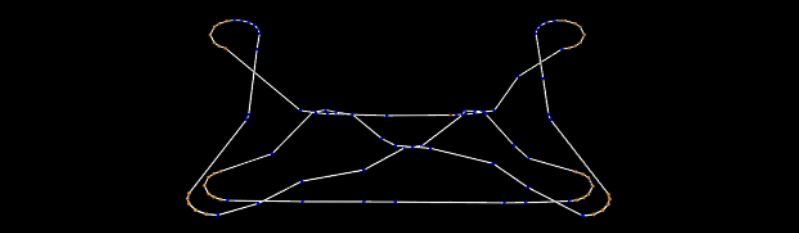

# Physical simulation for string figure.

## Introduction

String figure is a traditional game with a loop of string played by string manipulations (that is, hooking and/or unhooking strands of the loop from fingers) to produce patterns representing certain objects. Following is an instance of the string figure named "Jacob's ladder".

This page shows physical simulations for generating patterns of the string figure that change with string manipulations. In addition, this page provides the program codes used to perform the physical simulations.


Fig.1: The pattern of the string figure "Jacob's ladder"

Movie: [playing with the "Jacob's ladder"](https://youtu.be/6fOrDCtNgfA)
(This video has alternative string manipulations that are not the original one. (Specifically, the last step named "osage extension" is replaced).  The reason for this change is to make it easier to explain "string finger simulation.")

## Preliminary
We define terms of the string figure, and codes representing string manipulations.
These definitions are based on [string figure notation](https://www.alysion.org/figures/notation.htm).

### Definition of terms for the string figure.
- *noose* ... a strand of the loop hanging on a finger. The thumb noose is a noose hanging on the thumb. Similarly, we introduce the forefinger, middle finger, ring finger, and little finger noose. 
- *top noose*, *bottom noose* ... In the string figure, a finger sometimes has multiple nooses. To distinguish the multiple nooses, the words of the top noose and the bottom noose are used for the nooses hanging at the top and the bottom on a finger, respectively.
- *finger string* ... there are two points at which the noose string leaves the finger.  These two points are denoted as a *near finger string* and a *far finger string*, respectively. In addition, the points are collectively referred as finger strings. For example, the top noose string on the forefinger, which is farther from the player, is denoted as the top far forefinger string. 


Fig.2: terms of the string figure

### Definition of "finger movement code"
Finger movement codes denotes string manipulations of the string figure. This is a subset of the string figure notation.

```bnf
<code> := up <noose>
        | re <noose>
        | <finger> (ma | mt) tw <noose> .
        | <finger> <move>* pu (<noose> | <string>)
<finger> := T | F | M | R | L.
<move> := (mo | mu) <string>.
<string> := <height> <depth> <finger> S.
<noose> := <height> <finger> N.
<height>:= t | b | .
<depth> := n | f | .
```

The non-terminal symbol `<code>` represents a single movement in the string figure. `<finger>` is a single capital alphabet letter that denotes one of the five fingers. For example, T means the thumb. 

`up` denotes picking the bottom noose and placing it to the top of the figure. `re` denotes a finger movement to release a noose. *Releasing a finger noose* means the finger movement to unhook the noose from the finger.

`tw` denotes a 360-degree rotation of a finger noose. Direction of the rotation has two types, `ma` and `mt`; `ma` (move away) means to move the fingertip first away from the player and then rotate the finger downward, toward to the player, and upward in order. `mt` (move toward) means the inverse rotation. 

`pu` denotes a finger movement to pick up a noose or a string. *Picking up a noose* with a finger means releasing the noose and hooking it onto the finger. *Picking up a string* with a finger means the string manipulation to hook the string with the back of the finger and make a new finger noose.

## Generating patterns of the string figure by physical simulation

We divide the process of the string figure into separate parts for each string manipulation, and visualize the string pulling by physical simulation.
The following figure illustrates overview of the method.


Fig.3: overview of the method

- The initial strand path is composed by the sequence of 3D points for the initial pattern of the loop of the string.
- The simulation indicates a physical simulation with input as the initial strand path or the strand path after finger movement.
- The strand path is the sequence of the points for the string that is obtained at the end of the previous simulation.
- The path alteration is process to change the strand path according to the finger movement code, which represents a string manipulation.


### Simulation scene
Simulation scene consists of 5 cylinders on each side and a wire object.


Fig.4: a simulation scene

Movie: [a simulation scene in the middle of Jacob's ladder](https://youtu.be/e5aqfLBSoUo)

The lower cylinders and the upper cylinders correspond to thumbs and the little fingers respectively. The wire object represents the loop of the string.

During the simulation, the left and right cylinders move away from each other in the x-axis direction, and the string is pulled along with them. 
Exceptionally, in the simulation of the last scene, the cylinders are moved not only left and right but also up and down, so that all the cylinders move away from each other.

### String manipulation by altering paths
String manipulation is achieved by making changes to the wire path data without simulation. This process includes following four steps:
1. packing path of the wire object,
2. loosening the path, 
3. extending finger strings, and
4. path alteration according to a given string manipulation.

#### Packing the path of the wire object.

The path of the wire object is obtained from the final scene of the simulation.


Fig.5: a path information obtained from the final scene of the simulation

The path information is recorded as a sequence of three-dimensional points along the path. The first step is to shrink the x-axis range of the points. The packing algorithm first clusters the points according to Euclidean distance. And then the algorithm moves the clusters (and all points in them) along the x-axis so that all clusters are equally spaced.


Fig.6: packing algorithm overview




Fig.7: the result of applying the packing algorithm to the path information in Fig 4.


#### Loosening the path
This step moves the points along the z-axis to give a little slack to the path of the string.

#### Extending the finger strings
This step moves all of the nooses around the cylinders are moved left and right, and the finger string parts of the wire are extended. The extended parts of finger strings are used as “handles” for the following string manipulation.


Fig.8: Result of the finger string extension

#### Path alteration according to a string manipulation

Following figure shows the path of the wire resulting from the execution of the code `L mu fMS mo nMS pu bfTS` after Fig.8.
The actual path alteration is implemented by inserting new points and moving/deleting existing points.


Fig.9: The path after the alteration. The right figure shows the path taken by the camera at the different position and angle.

## Experiments of wire simulation
Following experiments are conducted to investigate whether existing physical simulators can simulate the strands in the string figure.

The simulation scenes are created by [AGX Dynamics](https://www.algoryx.se/agx-dynamics/) version 2.26.1.0.

We made the following five scenes, in which the left and right cylinders were moved away from each other in the x-axis direction during the simulation. During the simulation, the cylinder moved in the left and right x-axis directions for 10 minutes in real time.

NOTE: the following movies have been converted to play at 10x speed.

- S1: There are a middle finger noose on each side, and two strands are twisted at the center. 
<br/>
Movie: [Experiment S1](https://youtu.be/u4nQvAA3Yjo): The simulation successfully converged without wire object intrusion occurred. 
- S2: Same as S1, but the central strands are twisted twice. <br/>
Movie: [Experiment S2](https://youtu.be/fpfZ2EFWs78): 
The simulation successfully converged without wire object intrusion occurred. 
- S3: Same as S2 but one of the central strands has slack.
<br/>
Movie: [Experiment S3](https://youtu.be/oP_dTC62wMs): The simulation successfully converged without wire object intrusion occurred. The strands successfully slid at the twisted part and the slack was disappeared.
- S4: Both thumbs and little fingers have nooses. The far thumb strings cross each other at the center and follow to the near little finger strings on the same side.
<br/>
Movie: [Experiment S4](https://youtu.be/m0oEiwNUqVY): The simulation was failed because of wire object intrusion, and the central strands were unrealistically untangled.
- S5: The last simulation scene of Jacob’s ladder.
<br/>
Movie: [Experiment S5](https://youtu.be/dWUvdBkmsBw): This simulation required 10 minutes to disappear the slack of strands, after which we exceptionally continued the simulation for another 10 minutes.
The simulation successfully converged without wire object intrusion occurred.

## Experiments of string figure simulation
We picked up following six instances of the string figure from [WWW Collection of Favorite String Figures](http://www.alysion.org/figures/index.html)
- Man on a bed
- Pole star
- Twin stars
- Jacob's ladder
- Carrying wood
- Many stars

Each simulation scene continued for a maximum of 20 minutes, but was terminated when it was visually confirmed that there was no more slack in the strings.

### Man on a bed
Original string figure: [man on a bed](http://www.alysion.org/figures/moreeasy.htm#man)

Finger movement code:
```
OA;
T mu nFS mu fFS pu nLS;
L mo fFS mu nFS mo tfTS pu bfTS;
re FN;
```
- `OA` represents one of the first patterns of the string figure
- `OA` determines the initial strand path to be load first. 

Simulation: [movie](https://youtu.be/fRHMACJ9AdI)
- includes four simulation scenes
- converted to play at 10x speed
- The simulation has been successfully finished.

### Pole Star
Original string figure: [pole star](http://www.alysion.org/figures/moreeasy.htm#pole)

Finger movement code:
```
OA
T ma-tw TN; L mt-tw LN;
T mu nFS mu fFS pu nLS;
L mo fFS mu nFS mo tfTS pu bfTS;
re FN;
```
- In the second line, two codes that are independent of each other are inputed together to execute the path alteration.
- Thus, the number of simulation scenes is 5.

Simulation: [movie](https://youtu.be/u20373SNhfs)
- includes five simulation scenes
- converted to play at 10x speed
- The simulation has been successfully finished.

### Twin stars
Original string figure: [twin stars](http://www.alysion.org/figures/fairlyeasy.htm#twin)

Finger movement code:
```
japan
re TN;
T mo nMS mo fMS mo nLS pu fLS;
re LN;
L mo fMS mo nMS mo fTS pu nTS;
T pu nMS;
M pu LN;
re bTN; re bMN;
```
- `japan` is another the first pattern of the string figure
- The last three codes are different from the original string manipulation; the last step of string manipulations for "twin stars" is *Osage Extension*, which cannot be represented by a finger movement code. The last three codes are alternative codes that  possibly acheive the same results as the osage extension.

Simulation: [movie](https://youtu.be/sbImtVqkIX8)
- includes 8 simulation scenes
- converted to play at 10x speed
- The simulation has been successfully finished.

### Jacob's ladder
Original string figure: [osage diamonds](http://www.alysion.org/figures/fairlyeasy.htm#osage)

Finger movement code:
```
japan
re TN;
T mu nMS mu fMS mu nLS pu fLS;
T mo nMS pu fMS;
re LN;
L mu fMS mo nMS pu bfTS;
re TN; re TN;
T mo nMS mo fMS pu nLS;
T pu nMS;
M pu bTN;
re bMN; re LN;
```
- The last three codes are alternative codes of osage extension.

[](https://www.youtube.com/watch?v=DFebMQz08EA)

Simulation: [movie](https://youtu.be/DFebMQz08EA)
includes 10 simulation scenes
- converted to plate at 10x speed
- the simulation has been successsfully finished.

